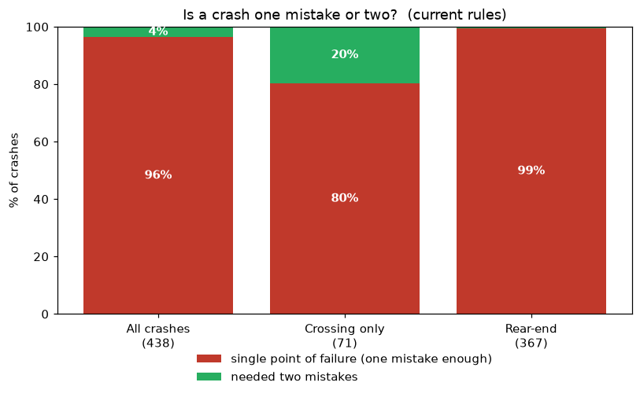

# Vehicle Experiment — Intersection Safety Simulation

An agent-based micro-simulation of one `+` intersection, built to answer a
single question:

> **Are the rules of the road a single-point-of-failure system — where one
> driver's mistake is enough to cause a crash — and can rule changes fix that?**

Cars follow the Intelligent Driver Model through a signalised intersection;
tunable driver imperfections (reaction delay, gap misjudgement, limited sight,
red-running, speeding) turn into crashes, which are classified by type and by
**fault** (did one mistake suffice, or did it take two?). We then try seven rule
changes — roundabout, protected-left phasing, speed governing, a sensor
interlock, stop-line setback, and combinations — and measure which actually
reduce harm.



*Under a realistic driver mix, 96% of crashes are single-point-of-failure — one
mistake is enough. That premise is the starting point for everything else.*

## Key findings

Full write-up in **[FINDINGS.md](FINDINGS.md)**. In one table (injury-weighted
severity, `type_weight × closing_speed²`, vs the permissive baseline):

| rule change | injury vs baseline |
|---|---|
| speed governing near the intersection | **−55%** (best single lever) |
| interlock + protected-left + green-extension | **−76%** (best overall) |
| protected-left phasing only | −33% |
| stop-line setback 15 ft | ≈0% (but fewer minor crashes, better flow) |
| governing + setback + interlock (combined) | −45% (**worse** than governing alone) |
| roundabout | eliminates T-bone & left-turn crashes; adds rear-ends |

**The takeaways:**

1. **Harm is about energy, not fault-counting.** No rule change made crashes
   "require two mistakes"; the winners reduced impact *energy* or removed severe
   crash *geometries*. Judge safety by severity, not crash count.
2. **Combining helps only when mechanisms are compatible** — the interlock +
   protected package stacks; governing + setback interferes.
3. **Rear-ends are the irreducible single-fault residue** — no intersection rule
   gates them without in-car tech.

## Quick start

```bash
pip install numpy matplotlib
python run.py            # headline scenarios + a validation baseline
python attribute.py      # fault diagnosis: what % of crashes need two mistakes
```

Each experiment is its own script; figures are written to `results/`:

| script | experiment |
|---|---|
| `compare.py` | signalised intersection vs roundabout |
| `compare_phasing.py` | permissive vs protected-only left turns |
| `compare_govern.py` | speed governing near the intersection |
| `compare_safe.py` | interlock / protected / green-extension gates |
| `compare_setback.py` | stop-line setback sweep (10–50 ft) |
| `compare_combo.py` | governing + setback + interlock package |
| `sweep.py` | parameter sweeps of the failure knobs |

## How it works

- **`sim/geometry.py`** — the intersection and roundabout paths (sampled
  polylines) and where conflicting paths cross.
- **`sim/vehicle.py`** — Intelligent Driver Model car-following and the driver
  imperfection knobs.
- **`sim/signal.py`** — fixed-time controller, permissive or protected left.
- **`sim/simulation.py`** — the main loop, right-of-way gap acceptance, the
  safety mechanisms (interlock, green-extension, governing, setback), and the
  counterfactual **fault attribution**.
- **`sim/roundabout.py`** — single-lane roundabout variant.
- **`sim/metrics.py`** — collisions by type and severity, plus surrogate
  near-miss measures.

The framing and hypotheses are in **[DESIGN.md](DESIGN.md)**.

### Fault attribution

For each crash, a **but-for counterfactual**: hold one driver on the path they
actually drove and re-simulate the other as an *ideal* driver (obeys the limit
and signal, judges gaps correctly, reacts promptly). If correcting *either*
driver alone would have prevented it → **two-fault**; otherwise → **single point
of failure**. Rear-ends use a transparent rule instead (the follower's fault
unless a speeder created the closing-speed differential), because the pairwise
counterfactual is ill-defined when the follower's path is a response to the
leader.

## Limitations

This is a research toy, not a traffic-engineering tool. Notably: severity is a
`closing-speed²` proxy (not calibrated to crash data); sight is a flat radius
(occlusion is hand-modelled); the roundabout is rear-end-heavy and does not
reproduce roundabouts' real injury reduction; results are single-intersection,
single-demand, and high-variance (6–8 seeds). See the full list in
[FINDINGS.md](FINDINGS.md#7-limitations-read-before-trusting-a-number).
